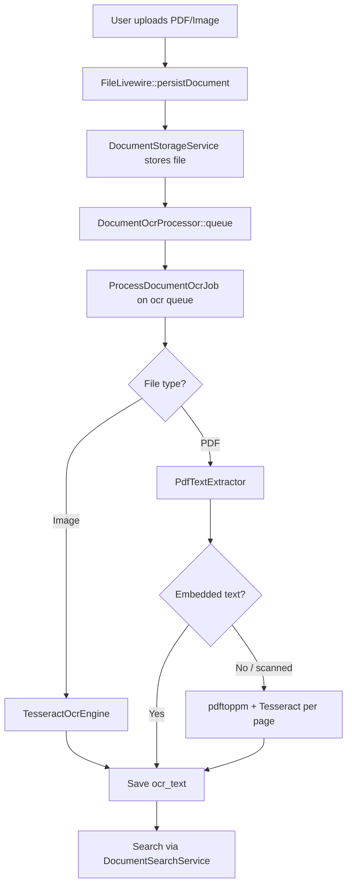

# OCR Implementation Report — Archive System (Laravel EDMS)

## Summary

Production-ready OCR pipeline for **PDF** and **image** documents with **Arabic + English** support, asynchronous queue processing, searchable extracted text, and admin UI for status/reprocessing.

---

## 1. What Was Installed

### Composer packages (PHP)

| Package | Purpose |
|---------|---------|
| `thiagoalessio/tesseract_ocr` | PHP wrapper for Tesseract CLI |
| `spatie/pdf-to-text` | Extract embedded text from PDFs via `pdftotext` |
| `smalot/pdfparser` | Pure-PHP PDF text fallback |

### System binaries (required — not bundled)

| Tool | Purpose | Windows install |
|------|---------|-----------------|
| **Tesseract OCR** | OCR for images & scanned PDF pages | `winget install UB-Mannheim.TesseractOCR` or `scripts/install-ocr-windows.ps1` |
| **Poppler** (`pdftotext`, `pdftoppm`) | PDF text layer + rasterize scanned PDFs | `winget install oschwartz10612.Poppler` |

**Language packs:** Tesseract must include `ara` and `eng`. Verify:

```bash
tesseract --list-langs
```

---

## 2. What Was Modified

| Area | Change |
|------|--------|
| **Upload flow** | `FileLivewire` queues OCR after storage |
| **Search** | `DocumentSearchService` searches `ocr_text` + MySQL FULLTEXT index |
| **Policies** | `FilePolicy::update()` for OCR reprocess permission |
| **UI** | OCR column in document list, OCR tab on document detail |
| **Queue** | `jobs` table migration, dedicated `ocr` queue |

---

## 3. New Files

```
config/ocr.php
app/Services/Ocr/OcrBinaryResolver.php
app/Services/Ocr/TesseractOcrEngine.php
app/Services/Ocr/PdfTextExtractor.php
app/Services/Ocr/DocumentOcrProcessor.php
app/Jobs/ProcessDocumentOcrJob.php
app/Console/Commands/OcrHealthCheckCommand.php
app/Console/Commands/ReprocessDocumentOcrCommand.php
database/migrations/2026_06_16_120000_add_ocr_status_fields_to_files.php
database/migrations/2026_06_14_202241_create_jobs_table.php
resources/views/components/ocr-status-badge.blade.php
scripts/install-ocr-windows.ps1
start-ocr-worker.bat
docs/OCR_IMPLEMENTATION_REPORT.md
```

---

## 4. Database Fields (`files` table)

| Column | Type | Description |
|--------|------|-------------|
| `ocr_text` | longText | Extracted searchable text (pre-existing) |
| `ocr_status` | string | `pending`, `processing`, `completed`, `failed`, `skipped` |
| `ocr_processed_at` | timestamp | Last processing time |
| `ocr_error` | text | Error message when failed |
| `ocr_languages` | string | e.g. `ara+eng` |
| `ocr_page_count` | smallint | Pages processed (PDF) |

**Index:** FULLTEXT on `(file_name, description, ocr_text)` when MySQL supports it.

---

## 5. How OCR Works Inside the System



### Processing rules

- **Supported:** `pdf`, `jpg`, `jpeg`, `png`, `tif`, `tiff`, `webp`
- **Skipped:** `doc`, `docx`, `xls`, `xlsx` → status `skipped`
- **PDF strategy:**
  1. Extract text via `smalot/pdfparser` + `pdftotext`
  2. If text too short → OCR up to `OCR_PDF_MAX_PAGES` pages (default 20)

---

## 6. Environment Configuration

Add to `.env`:

```env
QUEUE_CONNECTION=database
OCR_QUEUE_CONNECTION=database
OCR_QUEUE=ocr
OCR_LANGUAGES=ara+eng

TESSERACT_BINARY="C:\Program Files\Tesseract-OCR\tesseract.exe"
PDFTOTEXT_BINARY="C:\Program Files\poppler\Library\bin\pdftotext.exe"
PDFTOPPM_BINARY="C:\Program Files\poppler\Library\bin\pdftoppm.exe"

OCR_JOB_TRIES=3
OCR_JOB_TIMEOUT=600
OCR_PDF_MAX_PAGES=20
```

---

## 7. Commands

```bash
# Verify binaries & language packs
php artisan ocr:health

# Download Arabic/English language packs (no admin required)
php artisan ocr:install-languages --langs=ara,eng

# Reprocess one document
php artisan ocr:reprocess 42 --force

# Reprocess all pending/failed
php artisan ocr:reprocess

# Run worker (production)
php artisan queue:work database --queue=ocr,default --tries=3 --timeout=600
# Or on Windows:
start-ocr-worker.bat
```

---

## 8. Adding New Languages Later

1. Install Tesseract language pack (e.g. `fra.traineddata` in `tessdata` folder).
2. Register in `config/ocr.php` → `available_languages`.
3. Update `.env`: `OCR_LANGUAGES=ara+eng+fra`
4. Reprocess documents: `php artisan ocr:reprocess --force`

Language codes follow [ISO 639-2/3 Tesseract codes](https://tesseract-ocr.github.io/tessdoc/Data-Files-in-different-versions.html).

---

## 9. Linux Production Notes

```bash
sudo apt install tesseract-ocr tesseract-ocr-ara tesseract-ocr-eng poppler-utils
```

Set binaries in `.env` or rely on PATH auto-detection in `OcrBinaryResolver`.

---

## 10. Troubleshooting

| Issue | Fix |
|-------|-----|
| OCR stays `pending` | Start queue worker |
| `failed` — Tesseract not found | Run `ocr:health`, set `TESSERACT_BINARY` |
| Scanned PDF empty | Install Poppler, set `PDFTOPPM_BINARY` |
| Arabic garbled | Ensure `ara` in `tesseract --list-langs` |
| Slow large PDFs | Lower `OCR_PDF_MAX_PAGES` or increase worker timeout |

---

*Generated: OCR integration for Archive System Laravel EDMS*
